# 架构流程图

## 系统整体架构

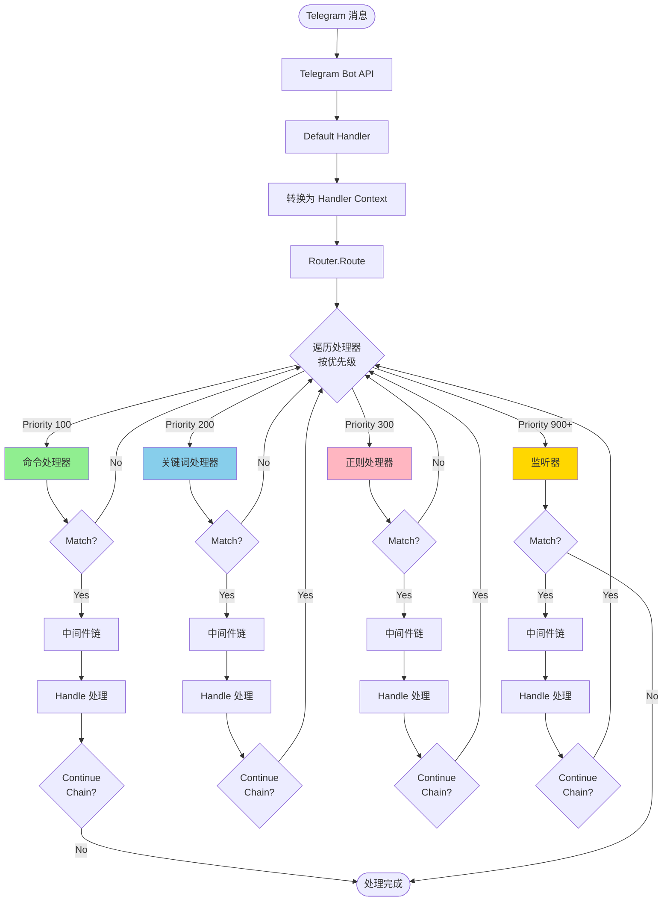

## 已实现的命令处理器（Priority: 100）

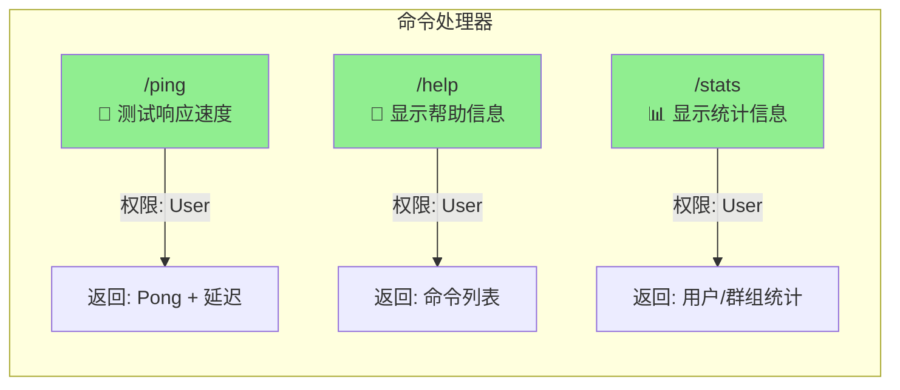

## 已实现的关键词处理器（Priority: 200）

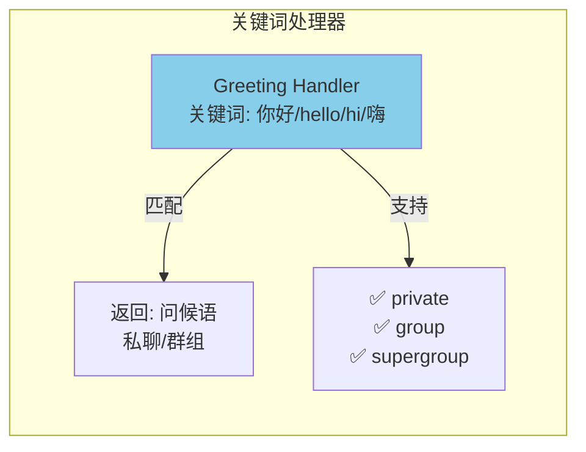

## 已实现的正则处理器（Priority: 300）

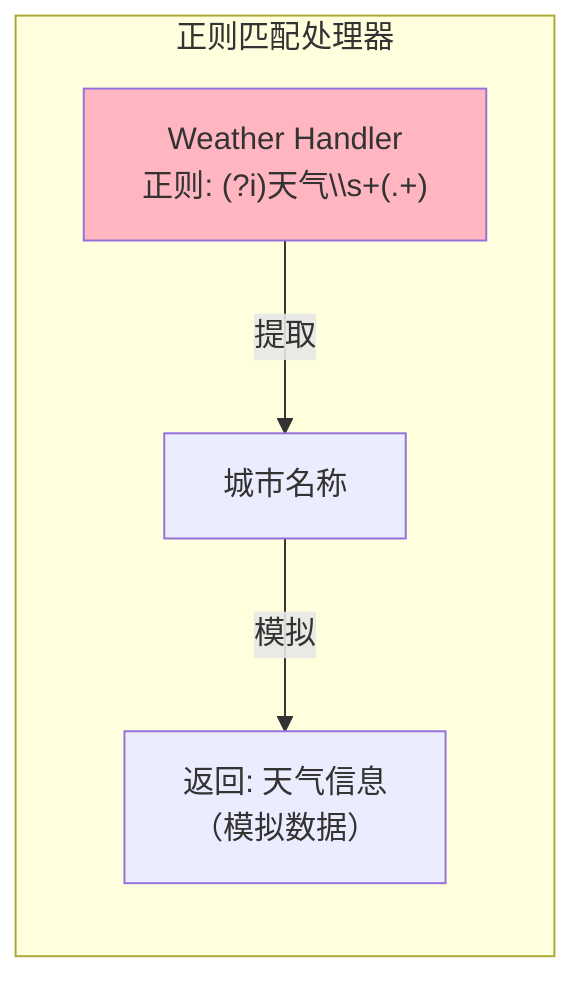

## 已实现的监听器（Priority: 900+）

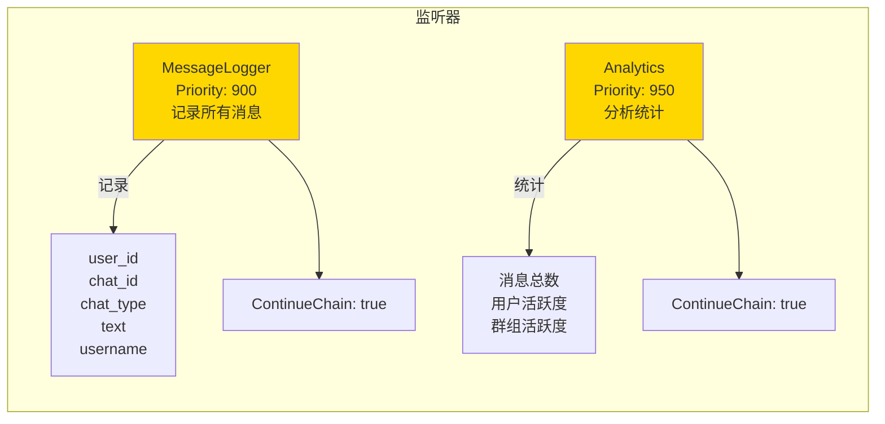

## 中间件执行流程（洋葱模型）

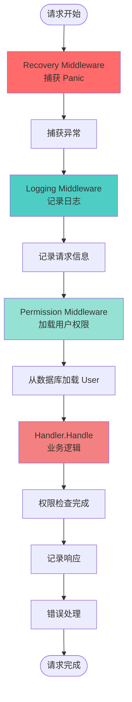

## 定时任务系统

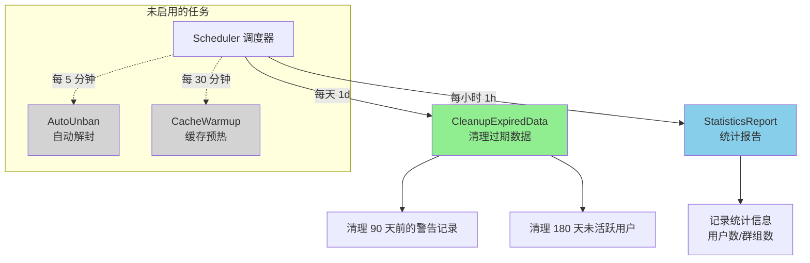

## 数据持久化架构

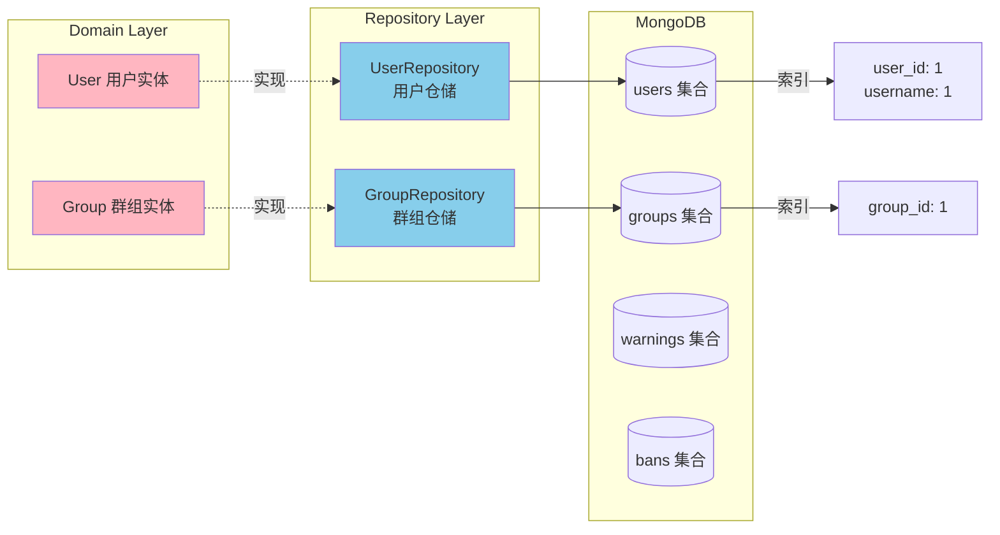

## 启动与关闭流程

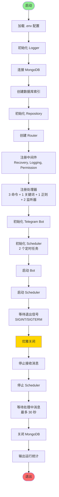

## 权限系统

```mermaid
graph TB
    subgraph Permission[权限等级]
        Owner[Owner 所有者<br/>Level: 4]
        SuperAdmin[SuperAdmin 超级管理员<br/>Level: 3]
        Admin[Admin 管理员<br/>Level: 2]
        User[User 普通用户<br/>Level: 1]
        None[None 无权限<br/>Level: 0]
    end

    Owner --> |可管理| SuperAdmin
    SuperAdmin --> |可管理| Admin
    Admin --> |可管理| User
    User --> |可管理| None

    subgraph PermCheck[权限检查]
        HasPerm[HasPermission<br/>检查权限]
        RequirePerm[RequirePermission<br/>要求权限]

        HasPerm --> |返回| Bool[true/false]
        RequirePerm --> |不足时| Error[返回错误信息]
    end

    subgraph PerGroup[按群组权限]
        UserPerms[User.Permissions<br/>map[groupID]Permission]

        UserPerms --> |私聊| UserID[使用 userID 作为 key]
        UserPerms --> |群组| GroupID[使用 chatID 作为 key]
    end

    style Owner fill:#FF6B6B
    style SuperAdmin fill:#FF8C42
    style Admin fill:#FFD166
    style User fill:#06FFA5
    style None fill:#D3D3D3
```

## 功能统计总览

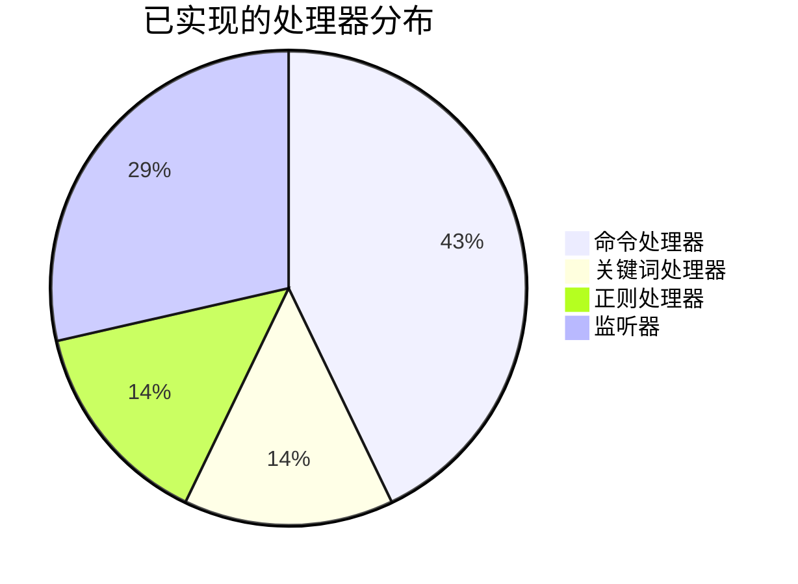

## 支持的聊天类型

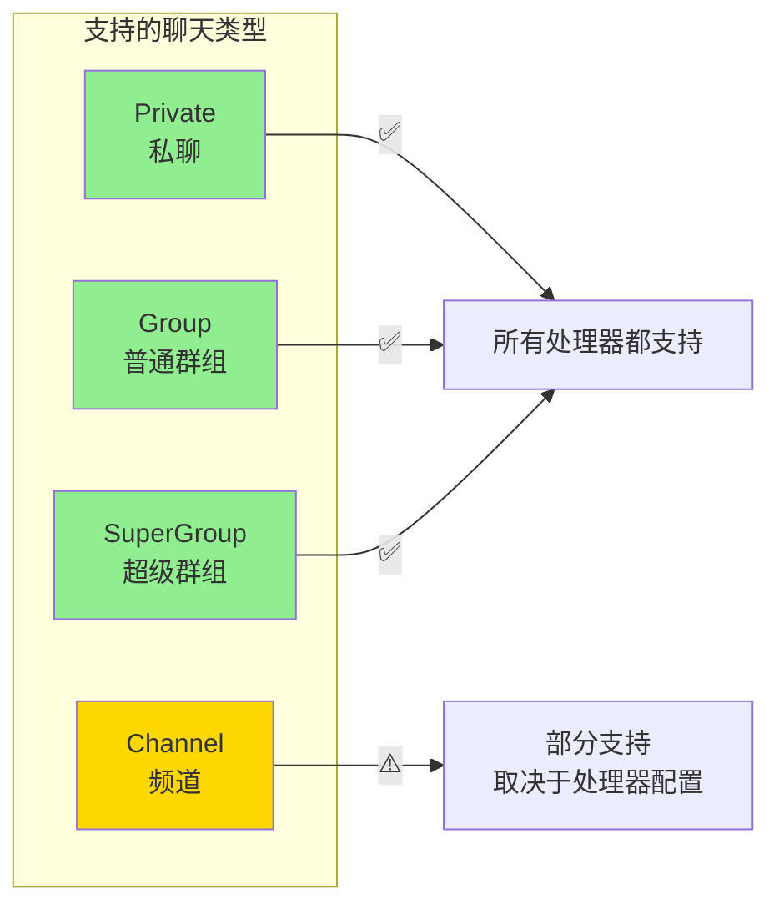

---

## 图例说明

| 颜色 | 说明 |
|-----|------|
| 🟢 绿色 | 命令处理器 |
| 🔵 蓝色 | 关键词/数据层 |
| 🟣 粉色 | 正则处理器/领域层 |
| 🟡 黄色 | 监听器/警告 |
| ⚪ 灰色 | 未启用功能 |
| 🔴 红色 | 关键节点/错误处理 |

---

## 快速功能索引

### ✅ 已实现功能

**命令（3 个）**:
- `/ping` - 测试 Bot 响应
- `/help` - 显示帮助信息
- `/stats` - 显示统计数据

**关键词（1 个）**:
- 问候语检测（你好/hello/hi/嗨）

**正则匹配（1 个）**:
- 天气查询（天气 + 城市名）

**监听器（2 个）**:
- MessageLogger - 消息日志记录
- Analytics - 数据分析统计

**中间件（3 个）**:
- Recovery - Panic 恢复
- Logging - 日志记录
- Permission - 权限加载

**定时任务（2 个启用）**:
- CleanupExpiredData - 清理过期数据（每天）
- StatisticsReport - 统计报告（每小时）

**数据库集合（4 个）**:
- users - 用户信息
- groups - 群组信息
- warnings - 警告记录
- bans - 封禁记录

### 🔧 配置的但未启用

**定时任务（2 个）**:
- AutoUnban - 自动解封（每 5 分钟）
- CacheWarmup - 缓存预热（每 30 分钟）

**中间件（1 个）**:
- RateLimit - 限流中间件（已实现但未注册）

---

**更新日期**: 2025-10-02
**架构版本**: v2.0.0
**维护者**: Telegram Bot Development Team
