# 🏗️ Telegram Bot 架构流程图

**完整的可视化架构文档 - 使用 Mermaid 图表展示所有核心组件和流程**

---

## 📖 目录

- [核心架构](#核心架构)
  - [系统整体架构](#系统整体架构)
  - [Handler 接口设计](#handler-接口设计)
  - [消息路由流程](#消息路由流程)
- [处理器详解](#处理器详解)
  - [命令处理器（8 个）](#命令处理器8-个)
  - [关键词处理器](#关键词处理器)
  - [正则处理器](#正则处理器)
  - [监听器](#监听器)
- [中间件系统](#中间件系统)
  - [洋葱模型](#洋葱模型)
  - [执行时序图](#执行时序图)
  - [各中间件功能](#各中间件功能)
- [权限系统](#权限系统)
  - [权限等级层次](#权限等级层次)
  - [权限检查流程](#权限检查流程)
  - [权限管理命令](#权限管理命令)
- [数据层](#数据层)
  - [数据持久化架构](#数据持久化架构)
  - [数据库实体关系](#数据库实体关系)
- [系统组件](#系统组件)
  - [项目目录结构](#项目目录结构)
  - [定时任务系统](#定时任务系统)
- [生命周期](#生命周期)
  - [启动流程](#启动流程)
  - [优雅关闭流程](#优雅关闭流程)
  - [消息处理完整流程](#消息处理完整流程)
- [统计与总览](#统计与总览)
  - [功能统计](#功能统计)
  - [支持的聊天类型](#支持的聊天类型)
  - [部署架构](#部署架构)

---

## 🎯 核心架构

### 系统整体架构

整个系统的消息处理流程，从 Telegram Update 到最终响应：

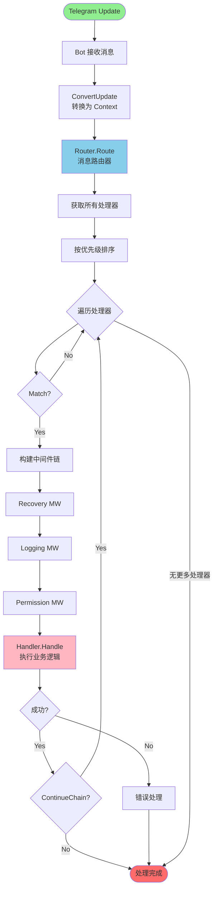

---

### Handler 接口设计

所有处理器必须实现的核心接口：

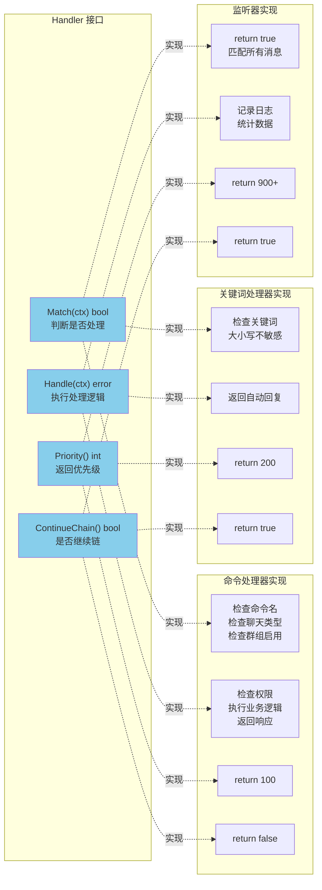

---

### 消息路由流程

Router 如何根据优先级分发消息到匹配的处理器：

```mermaid
graph TB
    Start([消息到达 Router]) --> Register[已注册处理器列表]

    Register --> Sort[按 Priority 排序<br/>0-99: 系统级<br/>100-199: 命令<br/>200-299: 关键词<br/>300-399: 正则<br/>900-999: 监听器]

    Sort --> Loop{遍历<br/>处理器}

    Loop --> H1[命令处理器<br/>Priority: 100]
    H1 --> M1{Match?}
    M1 -->|Yes| Exec1[执行 + 中间件]
    M1 -->|No| Loop
    Exec1 --> C1{Continue?}
    C1 -->|No| End([结束])
    C1 -->|Yes| Loop

    Loop --> H2[关键词处理器<br/>Priority: 200]
    H2 --> M2{Match?}
    M2 -->|Yes| Exec2[执行 + 中间件]
    M2 -->|No| Loop
    Exec2 --> C2{Continue?}
    C2 -->|No| End
    C2 -->|Yes| Loop

    Loop --> H3[正则处理器<br/>Priority: 300]
    H3 --> M3{Match?}
    M3 -->|Yes| Exec3[执行 + 中间件]
    M3 -->|No| Loop
    Exec3 --> C3{Continue?}
    C3 -->|No| End
    C3 -->|Yes| Loop

    Loop --> H4[监听器<br/>Priority: 900+]
    H4 --> M4{Match?}
    M4 -->|Yes| Exec4[执行 + 中间件]
    M4 -->|No| Loop
    Exec4 --> C4{Continue?}
    C4 -->|Yes| Loop
    C4 -->|No| End

    Loop -->|无更多处理器| End

    style H1 fill:#90EE90
    style H2 fill:#87CEEB
    style H3 fill:#FFB6C1
    style H4 fill:#FFD700
```

---

## 🔧 处理器详解

### 命令处理器（8 个）

所有已实现的命令处理器及其功能：

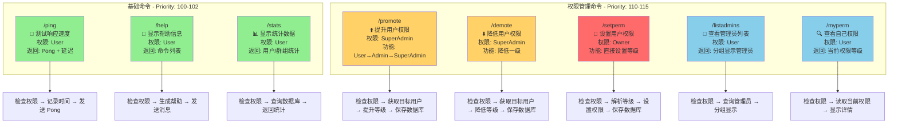

---

### 关键词处理器

检测并响应特定关键词：

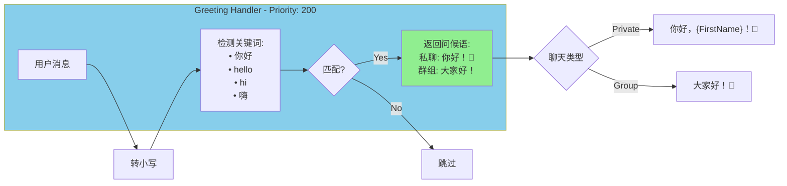

---

### 正则处理器

使用正则表达式匹配复杂模式：

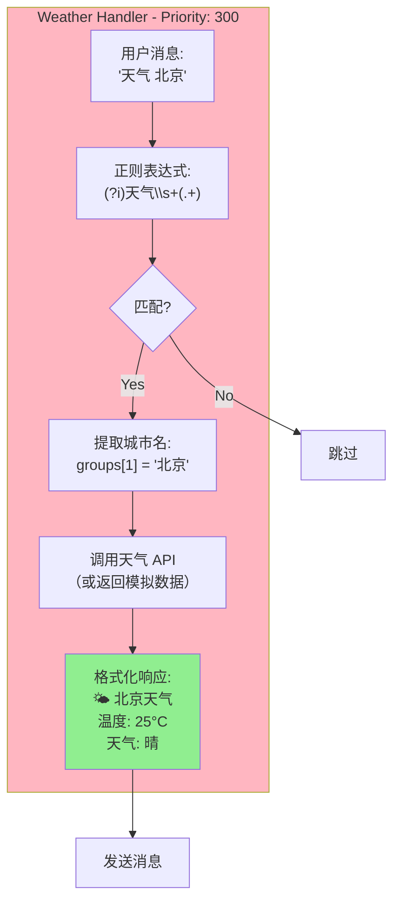

---

### 监听器

监听所有消息，用于日志和统计：

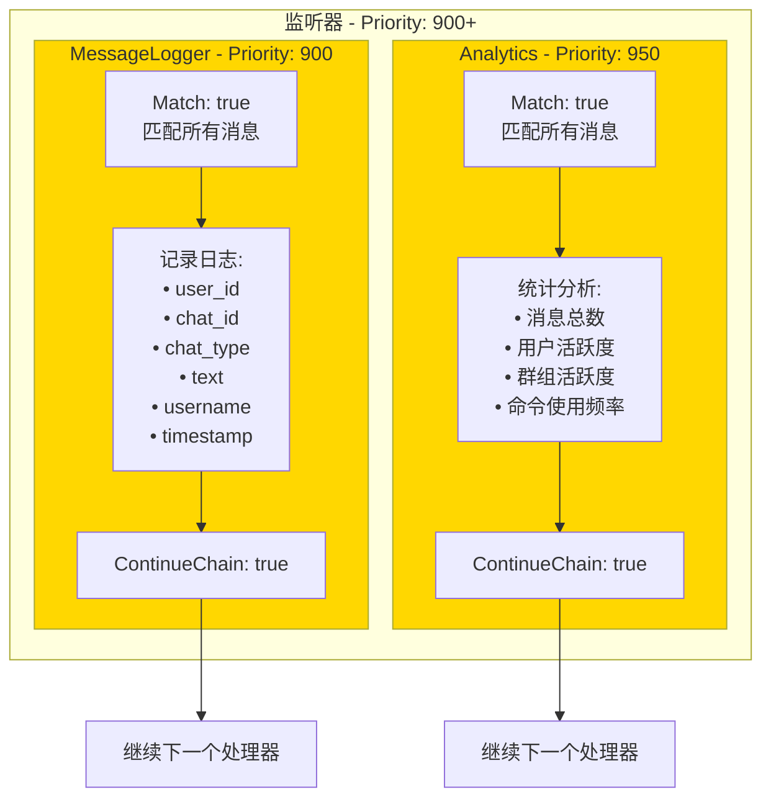

---

## 🛡️ 中间件系统

### 洋葱模型

中间件的层层包装执行模式：

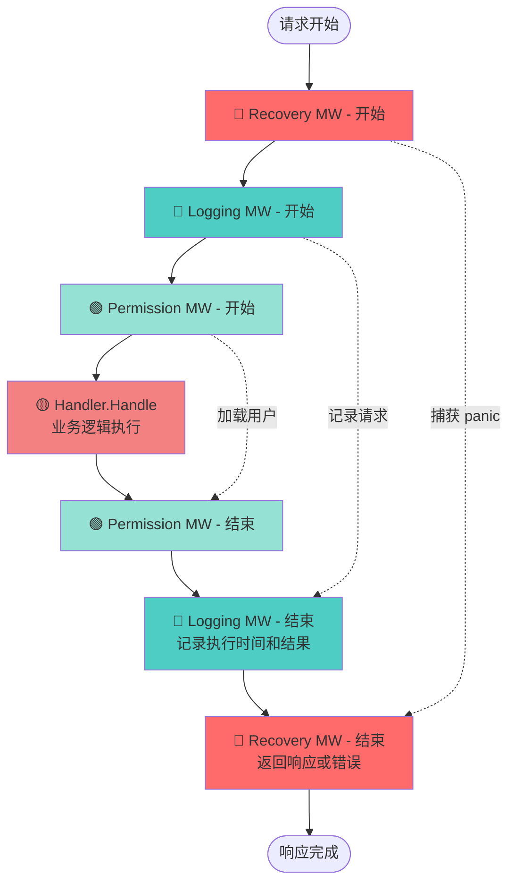

---

### 执行时序图

中间件和处理器的时间顺序执行：

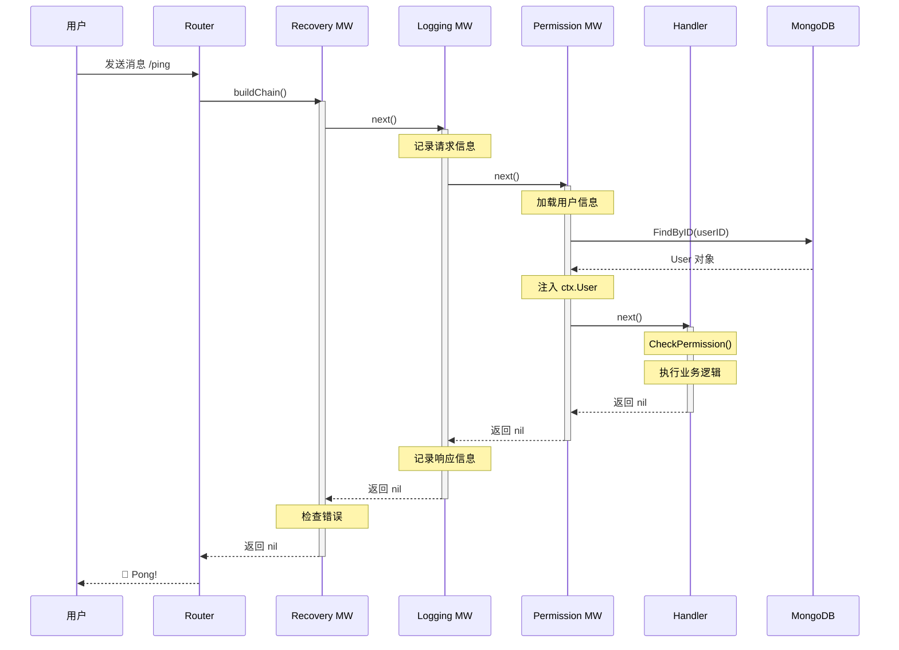

---

### 各中间件功能

四个核心中间件的详细功能：

```mermaid
graph TB
    subgraph RecoveryMW[Recovery Middleware]
        RecoveryStart["开始执行"]
        RecoveryDefer["defer recover()"]
        RecoveryNext["调用 next()"]
        RecoveryCheck{发生 panic?}
        RecoveryLog["记录堆栈信息"]
        RecoveryReply["返回友好错误"]
        RecoveryEnd["结束执行"]

        RecoveryStart --> RecoveryDefer
        RecoveryDefer --> RecoveryNext
        RecoveryNext --> RecoveryCheck
        RecoveryCheck -->|No| RecoveryEnd
        RecoveryCheck -->|Yes| RecoveryLog
        RecoveryLog --> RecoveryReply
        RecoveryReply --> RecoveryEnd
    end

    subgraph LoggingMW[Logging Middleware]
        LogStart["记录开始时间"]
        LogInfo["记录请求信息:<br/>user_id, chat_type, text"]
        LogNext["调用 next()"]
        LogCalc["计算执行时间"]
        LogResult{成功?}
        LogSuccess["记录成功日志"]
        LogError["记录错误日志"]

        LogStart --> LogInfo
        LogInfo --> LogNext
        LogNext --> LogCalc
        LogCalc --> LogResult
        LogResult -->|Yes| LogSuccess
        LogResult -->|No| LogError
    end

    subgraph PermissionMW[Permission Middleware]
        PermLoad["从数据库加载用户"]
        PermCheck{用户存在?}
        PermCreate["创建新用户<br/>默认权限: User"]
        PermInject["注入 ctx.User"]
        PermNext["调用 next()"]

        PermLoad --> PermCheck
        PermCheck -->|Yes| PermInject
        PermCheck -->|No| PermCreate
        PermCreate --> PermInject
        PermInject --> PermNext
    end

    subgraph RateLimitMW[RateLimit Middleware]
        RateCheck{检查令牌桶}
        RateAllow["允许通过"]
        RateDeny["返回限流错误"]
        RateNext["调用 next()"]

        RateCheck -->|有令牌| RateAllow
        RateCheck -->|无令牌| RateDeny
        RateAllow --> RateNext
    end

    style RecoveryMW fill:#FF6B6B
    style LoggingMW fill:#4ECDC4
    style PermissionMW fill:#95E1D3
    style RateLimitMW fill:#FFD166
```

---

## 🔐 权限系统

### 权限等级层次

四级权限的层次关系：

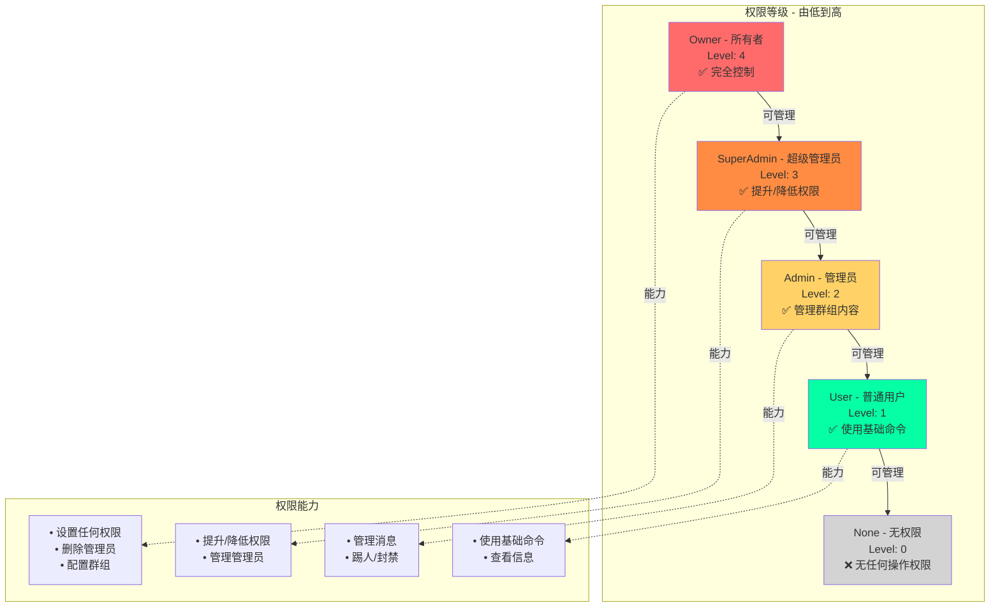

---

### 权限检查流程

消息处理时的权限验证流程：

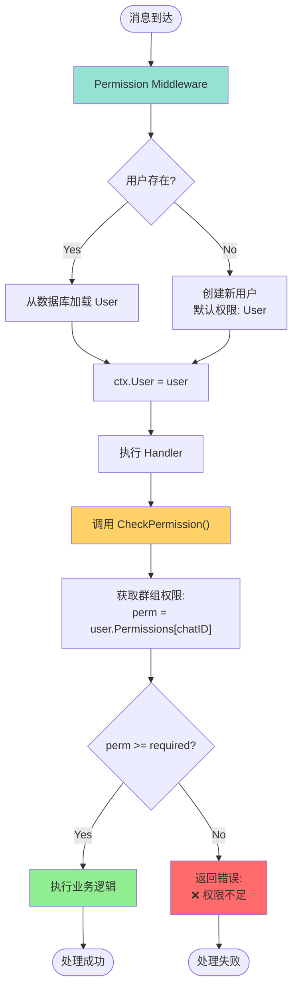

---

### 权限管理命令

promote、demote、setperm 的执行流程：

```mermaid
graph TB
    subgraph PromoteFlow[/promote 提升权限]
        P1["接收命令: /promote @user"]
        P2{检查权限:<br/>SuperAdmin?}
        P3["解析目标用户"]
        P4["获取目标当前权限"]
        P5{当前权限 < 自己权限?}
        P6["提升一级:<br/>User→Admin<br/>Admin→SuperAdmin<br/>SuperAdmin→Owner"]
        P7["保存到数据库"]
        P8["返回成功消息"]

        P1 --> P2
        P2 -->|No| PErr1["❌ 权限不足"]
        P2 -->|Yes| P3
        P3 --> P4
        P4 --> P5
        P5 -->|No| PErr2["❌ 无法提升"]
        P5 -->|Yes| P6
        P6 --> P7
        P7 --> P8
    end

    subgraph DemoteFlow[/demote 降低权限]
        D1["接收命令: /demote @user"]
        D2{检查权限:<br/>SuperAdmin?}
        D3["解析目标用户"]
        D4["获取目标当前权限"]
        D5{目标权限 < 自己权限?}
        D6["降低一级:<br/>Owner→SuperAdmin<br/>SuperAdmin→Admin<br/>Admin→User"]
        D7["保存到数据库"]
        D8["返回成功消息"]

        D1 --> D2
        D2 -->|No| DErr1["❌ 权限不足"]
        D2 -->|Yes| D3
        D3 --> D4
        D4 --> D5
        D5 -->|No| DErr2["❌ 无法降低"]
        D5 -->|Yes| D6
        D6 --> D7
        D7 --> D8
    end

    subgraph SetPermFlow[/setperm 设置权限]
        S1["接收命令:<br/>/setperm @user admin"]
        S2{检查权限:<br/>Owner?}
        S3["解析目标用户和等级"]
        S4["直接设置权限"]
        S5["保存到数据库"]
        S6["返回成功消息"]

        S1 --> S2
        S2 -->|No| SErr1["❌ 权限不足<br/>仅 Owner 可用"]
        S2 -->|Yes| S3
        S3 --> S4
        S4 --> S5
        S5 --> S6
    end

    style PromoteFlow fill:#FFD166
    style DemoteFlow fill:#FFD166
    style SetPermFlow fill:#FF6B6B
```

---

## 💾 数据层

### 数据持久化架构

从领域模型到数据库的完整架构：

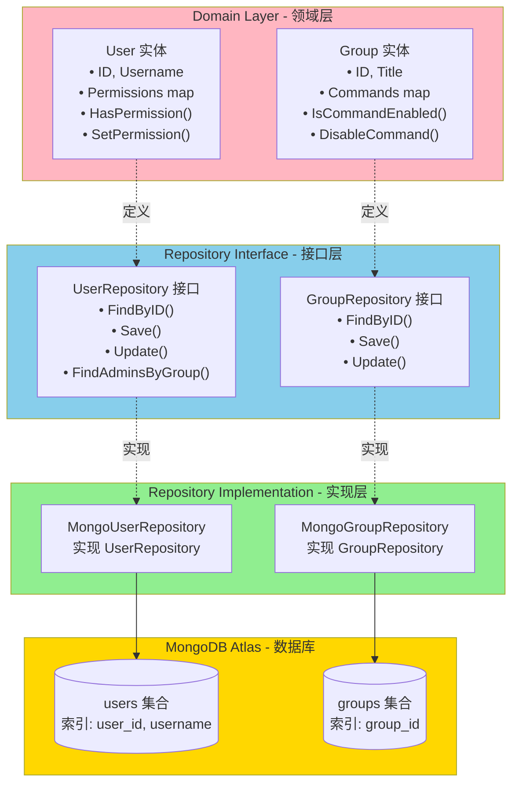

---

### 数据库实体关系

User 和 Group 实体的结构和关系：

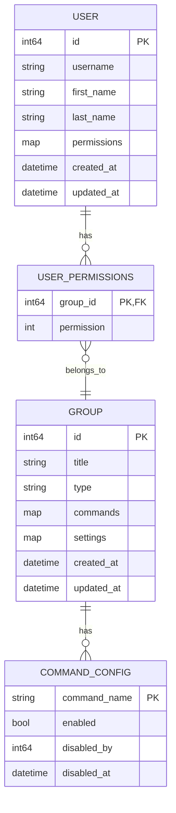

---

## 🗂️ 系统组件

### 项目目录结构

完整的项目文件组织：

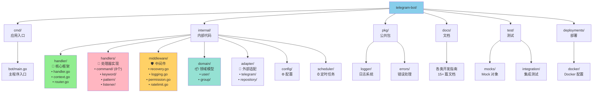

---

### 定时任务系统

Scheduler 和定时任务的执行机制：

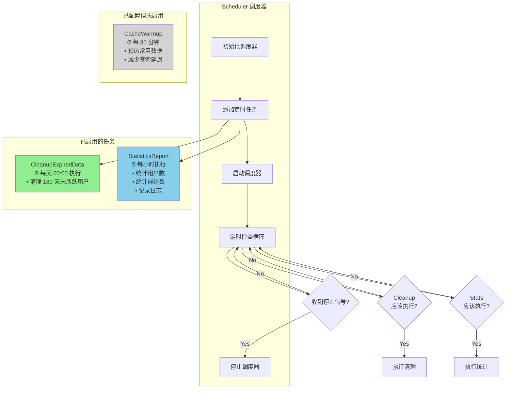

---

## 🔄 生命周期

### 启动流程

从程序启动到 Bot 运行的完整流程：

```mermaid
graph TB
    Start([main 函数启动]) --> LoadEnv["1. 加载 .env 配置<br/>godotenv.Load()"]
    LoadEnv --> InitConfig["2. 初始化配置<br/>config.Load()"]
    InitConfig --> InitLogger["3. 初始化 Logger<br/>logger.New()"]

    InitLogger --> ConnMongo["4. 连接 MongoDB<br/>mongo.Connect()"]
    ConnMongo --> CreateIndex["5. 创建数据库索引<br/>EnsureIndexes()"]
    CreateIndex --> InitRepo["6. 初始化 Repository<br/>UserRepo, GroupRepo"]

    InitRepo --> CreateRouter["7. 创建 Router<br/>handler.NewRouter()"]
    CreateRouter --> RegMW["8. 注册中间件<br/>• Recovery<br/>• Logging<br/>• Permission"]
    RegMW --> RegHandlers["9. 注册处理器<br/>• 8 个命令<br/>• 1 个关键词<br/>• 1 个正则<br/>• 2 个监听器"]

    RegHandlers --> InitBot["10. 初始化 Telegram Bot<br/>bot.New()"]
    InitBot --> InitScheduler["11. 初始化 Scheduler<br/>添加 2 个定时任务"]

    InitScheduler --> SetupSignal["12. 设置信号处理<br/>SIGINT, SIGTERM"]
    SetupSignal --> StartBot["13. 启动 Bot<br/>bot.Start()"]
    StartBot --> StartScheduler["14. 启动 Scheduler<br/>scheduler.Start()"]

    StartScheduler --> Running["15. 运行中...<br/>等待消息和信号"]

    Running --> Ready([✅ Bot 就绪])

    style Start fill:#90EE90
    style Running fill:#87CEEB
    style Ready fill:#90EE90
```

---

### 优雅关闭流程

接收到停止信号后的优雅关闭过程：

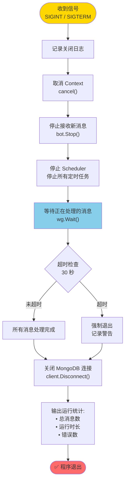

---

### 消息处理完整流程

单条消息从接收到响应的完整生命周期：

```mermaid
graph TB
    Start([Telegram 发送消息]) --> Receive["Bot 接收 Update"]
    Receive --> Convert["ConvertUpdate<br/>创建 Context"]

    Convert --> WGAdd["WaitGroup.Add(1)<br/>追踪消息处理"]
    WGAdd --> Route["Router.Route(ctx)"]

    Route --> GetHandlers["获取已注册处理器"]
    GetHandlers --> Sort["按 Priority 排序"]
    Sort --> Loop{遍历处理器}

    Loop --> Match{Match(ctx)?}
    Match -->|No| Loop
    Match -->|Yes| BuildChain["构建中间件链"]

    BuildChain --> Recovery["Recovery MW<br/>defer recover()"]
    Recovery --> Logging["Logging MW<br/>记录开始时间"]
    Logging --> Permission["Permission MW<br/>加载 ctx.User"]
    Permission --> Handle["Handler.Handle(ctx)"]

    Handle --> Success{执行成功?}
    Success -->|Yes| Continue{ContinueChain()?}
    Success -->|No| LogError["记录错误日志"]

    Continue -->|Yes| Loop
    Continue -->|No| Complete["处理完成"]
    LogError --> Complete

    Loop -->|无更多处理器| Complete
    Complete --> WGDone["WaitGroup.Done()"]
    WGDone --> End([响应发送给用户])

    style Start fill:#90EE90
    style Handle fill:#FFB6C1
    style Complete fill:#87CEEB
    style End fill:#90EE90
```

---

## 📊 统计与总览

### 功能统计

已实现功能的数量分布：

```mermaid
pie title 处理器类型分布
    "命令处理器 (8个)" : 8
    "关键词处理器 (1个)" : 1
    "正则处理器 (1个)" : 1
    "监听器 (2个)" : 2
```

```mermaid
pie title 命令类型分布
    "基础命令 (3个)" : 3
    "权限管理命令 (5个)" : 5
```

```mermaid
pie title 中间件分布
    "Recovery" : 1
    "Logging" : 1
    "Permission" : 1
    "RateLimit (可选)" : 1
```

---

### 支持的聊天类型

不同聊天类型的支持情况：

```mermaid
graph LR
    subgraph ChatTypes[支持的聊天类型]
        Private["Private<br/>私聊<br/>1v1 对话"]
        Group["Group<br/>普通群组<br/>≤200 人"]
        SuperGroup["SuperGroup<br/>超级群组<br/>200+ 人"]
        Channel["Channel<br/>频道<br/>广播模式"]
    end

    subgraph Support[支持程度]
        Full["✅ 完全支持<br/>所有功能可用"]
        Partial["⚠️ 部分支持<br/>取决于处理器配置"]
    end

    Private --> Full
    Group --> Full
    SuperGroup --> Full
    Channel --> Partial

    Full --> Features1["• 所有命令<br/>• 权限系统<br/>• 关键词检测<br/>• 日志记录"]
    Partial --> Features2["• 部分命令<br/>• 受限权限<br/>• 消息监听"]

    style Private fill:#90EE90
    style Group fill:#90EE90
    style SuperGroup fill:#90EE90
    style Channel fill:#FFD700
```

---

### 部署架构

生产环境的部署拓扑：

```mermaid
graph TB
    subgraph Internet[互联网]
        Telegram["Telegram Servers<br/>telegram.org"]
    end

    subgraph DockerHost[Docker 宿主机]
        subgraph Container[Bot Container]
            App["Telegram Bot<br/>Go 应用程序<br/>• Router<br/>• Handlers<br/>• Middleware"]
        end
    end

    subgraph Cloud[MongoDB Atlas<br/>云数据库]
        Primary["Primary Node<br/>主节点"]
        Secondary1["Secondary Node<br/>从节点 1"]
        Secondary2["Secondary Node<br/>从节点 2"]
    end

    subgraph Monitoring[监控 (可选)]
        Logs["日志收集<br/>ELK / Loki"]
        Metrics["指标监控<br/>Prometheus"]
    end

    Telegram <-->|HTTPS<br/>长轮询| App
    App <-->|MongoDB Protocol<br/>连接池| Primary
    Primary -.复制.-> Secondary1
    Primary -.复制.-> Secondary2

    App -.日志.-> Logs
    App -.指标.-> Metrics

    style Telegram fill:#87CEEB
    style Container fill:#90EE90
    style Cloud fill:#FFD700
    style Monitoring fill:#D3D3D3
```

---

## 📈 性能指标

关键性能数据可视化：

```mermaid
graph LR
    subgraph Metrics[性能指标]
        MsgSpeed["消息处理速度<br/>~500 msg/s<br/>单实例"]
        MemUsage["内存占用<br/>~50-100 MB<br/>稳定运行"]
        DBQuery["数据库查询<br/>~5-10 ms<br/>平均延迟"]
        StartTime["启动时间<br/>~2-3 秒<br/>从启动到就绪"]
    end

    subgraph Optimization[优化措施]
        Index["MongoDB 索引<br/>• user_id<br/>• username<br/>• group_id"]
        ConnPool["连接池<br/>• 最小: 10<br/>• 最大: 100"]
        Goroutine["并发处理<br/>• 每消息一个 goroutine<br/>• WaitGroup 追踪"]
        Middleware["中间件缓存<br/>• 用户信息缓存<br/>• 权限缓存"]
    end

    MsgSpeed -.优化.-> Goroutine
    MemUsage -.优化.-> ConnPool
    DBQuery -.优化.-> Index
    StartTime -.优化.-> Middleware

    style Metrics fill:#87CEEB
    style Optimization fill:#90EE90
```

---

## 📋 图例说明

### 颜色含义

| 颜色 | 用途 | Hex 值 |
|------|------|--------|
| 🟢 **绿色** | 命令处理器、成功状态、启用功能 | `#90EE90` |
| 🔵 **蓝色** | 关键词处理器、数据层、Router | `#87CEEB` |
| 🟣 **粉色** | 正则处理器、领域层、Handler | `#FFB6C1` |
| 🟡 **黄色** | 监听器、警告、Channel | `#FFD700` |
| 🔴 **红色** | 错误处理、关键节点、Owner 权限 | `#FF6B6B` |
| 🟠 **橙色** | SuperAdmin 权限 | `#FF8C42` |
| 🟡 **浅黄** | Admin 权限、中间件 | `#FFD166` |
| 🟢 **青色** | User 权限、Permission MW | `#06FFA5`, `#95E1D3` |
| ⚪ **灰色** | 未启用功能、禁用状态 | `#D3D3D3` |

### 形状说明

| 形状 | 用途 |
|------|------|
| `[ ]` 矩形 | 处理步骤、功能模块 |
| `[( )]` 圆角矩形 | 开始/结束节点 |
| `{ }` 菱形 | 判断/决策节点 |
| `(( ))` 圆形 | 数据库、存储 |
| `[[ ]]` 子图 | 逻辑分组 |

---

## 🔍 快速索引

### 按功能查找图表

| 功能 | 图表 |
|------|------|
| **整体架构** | [系统整体架构](#系统整体架构) |
| **消息路由** | [消息路由流程](#消息路由流程) |
| **命令列表** | [命令处理器](#命令处理器8-个) |
| **权限管理** | [权限等级层次](#权限等级层次)、[权限检查流程](#权限检查流程) |
| **中间件** | [洋葱模型](#洋葱模型)、[执行时序图](#执行时序图) |
| **数据库** | [数据持久化架构](#数据持久化架构)、[数据库实体关系](#数据库实体关系) |
| **启动关闭** | [启动流程](#启动流程)、[优雅关闭流程](#优雅关闭流程) |
| **部署** | [部署架构](#部署架构) |

### 已实现功能清单

**命令（8 个）**:
- `/ping` - 测试 Bot 响应
- `/help` - 显示帮助信息
- `/stats` - 显示统计数据
- `/promote` - 提升用户权限
- `/demote` - 降低用户权限
- `/setperm` - 设置用户权限
- `/listadmins` - 查看管理员列表
- `/myperm` - 查看自己权限

**关键词（1 个）**:
- Greeting - 问候语检测（你好/hello/hi/嗨）

**正则匹配（1 个）**:
- Weather - 天气查询（天气 + 城市名）

**监听器（2 个）**:
- MessageLogger - 消息日志记录
- Analytics - 数据分析统计

**中间件（4 个）**:
- Recovery - Panic 恢复
- Logging - 日志记录
- Permission - 权限加载
- RateLimit - 限流控制（可选）

**定时任务（2 个启用 + 1 个配置）**:
- ✅ CleanupExpiredData - 清理过期数据（每天）
- ✅ StatisticsReport - 统计报告（每小时）
- ⚪ CacheWarmup - 缓存预热（每 30 分钟）- 未启用

**数据库集合（2 个）**:
- `users` - 用户信息
- `groups` - 群组信息

---

## 📚 相关文档

- [完整架构文档](./architecture.md) - 文字详细说明
- [快速入门指南](./getting-started.md) - 5 分钟上手
- [开发者 API 参考](./developer-api.md) - 完整 API 文档
- [命令处理器开发](./handlers/command-handler-guide.md) - 开发命令处理器
- [中间件开发指南](./middleware-guide.md) - 开发中间件

---

<div align="center">

**📊 本文档包含 26+ 个 Mermaid 图表**

**🔄 最后更新**: 2025-10-04
**📦 架构版本**: v2.0.0
**👥 维护者**: Telegram Bot Development Team

Made with ❤️ using [Mermaid](https://mermaid.js.org/)

</div>
